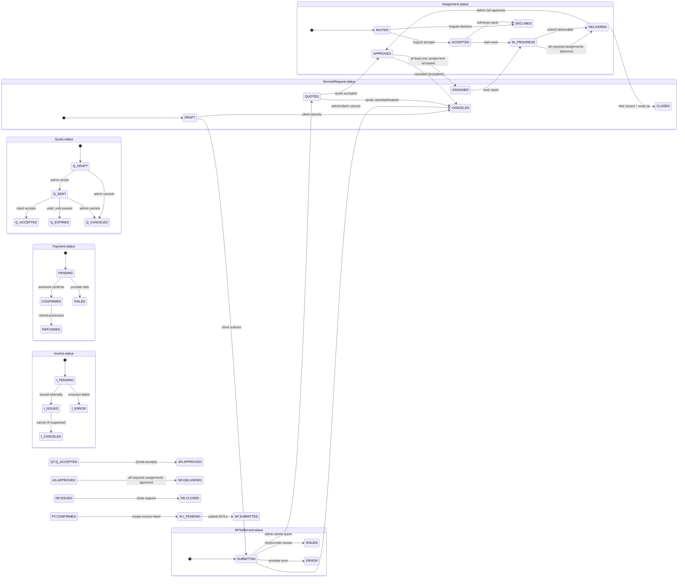

```mermaid
stateDiagram-v2
  direction LR

  %% =========================
  %% ServiceRequest.status
  %% =========================
  state "ServiceRequest.status" as SR {
    [*] --> DRAFT
    DRAFT --> SUBMITTED : client submits
    SUBMITTED --> QUOTED : admin sends quote
    QUOTED --> APPROVED : quote accepted
    APPROVED --> ASSIGNED : at least one assignment accepted
    ASSIGNED --> IN_PROGRESS : work starts
    IN_PROGRESS --> DELIVERED : all required assignments delivered
    DELIVERED --> CLOSED : nfse issued + wrap up
    DRAFT --> CANCELED : client cancels
    SUBMITTED --> CANCELED : admin/client cancels
    QUOTED --> CANCELED : quote canceled/expired
    APPROVED --> CANCELED : canceled (exception)
  }

  %% =========================
  %% Quote.status
  %% =========================
  state "Quote.status" as QT {
    [*] --> Q_DRAFT
    Q_DRAFT --> Q_SENT : admin sends
    Q_SENT --> Q_ACCEPTED : client accepts
    Q_SENT --> Q_EXPIRED : valid_until passed
    Q_DRAFT --> Q_CANCELED : admin cancels
    Q_SENT --> Q_CANCELED : admin cancels
  }

  %% =========================
  %% Assignment.status
  %% =========================
  state "Assignment.status" as AS {
    [*] --> INVITED
    INVITED --> ACCEPTED : linguist accepts
    INVITED --> DECLINED : linguist declines
    ACCEPTED --> IN_PROGRESS : start work
    IN_PROGRESS --> DELIVERED : submit deliverable
    DELIVERED --> APPROVED : admin QA approves
    ACCEPTED --> DECLINED : withdraw (rare)
  }

  %% =========================
  %% Payment.status
  %% =========================
  state "Payment.status" as PY {
    [*] --> PENDING
    PENDING --> CONFIRMED : webhook confirms
    PENDING --> FAILED : provider fails
    CONFIRMED --> REFUNDED : refund processed
  }

  %% =========================
  %% Invoice.status
  %% =========================
  state "Invoice.status" as IN {
    [*] --> I_PENDING
    I_PENDING --> I_ISSUED : issued internally
    I_PENDING --> I_ERROR : emission failed
    I_ISSUED --> I_CANCELED : cancel (if supported)
  }

  %% =========================
  %% NFSeRecord.status
  %% =========================
  state "NFSeRecord.status" as NF {
    [*] --> SUBMITTED
    SUBMITTED --> ISSUED : city/provider issues
    SUBMITTED --> ERROR : provider error
  }

  %% =========================
  %% Cross-model coupling (key transitions)
  %% =========================
  QT.Q_ACCEPTED --> SR.APPROVED : Quote.accept()
  AS.APPROVED --> SR.DELIVERED : all required assignments approved
  PY.CONFIRMED --> IN.I_PENDING : create invoice intent
  IN.I_PENDING --> NF.SUBMITTED : submit NFS-e
  NF.ISSUED --> SR.CLOSED : close request
```